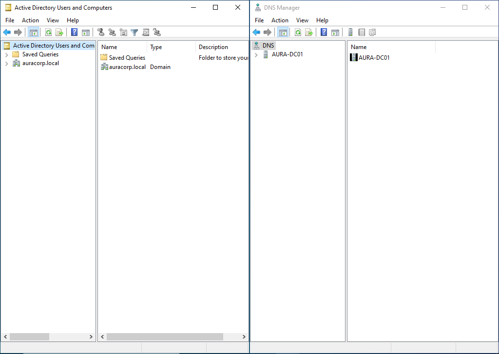

In this phase, we will install Active Directory.

In powershell:
Install-WindowsFeature -Name AD-Domain-Services -IncludeManagementTools

This command will install the feature and when it finishes, we will need to promote the server to a domain controller through the server manager dashboard.

We will be adding a new forest under the name of auracorp.local.
The forest is the highest level of container in AD. Since AuraCorp is a brand-new startup, we are creating the very first forest and domain.

We selected Windows Server 2022 as the functional level to ensure all modern AD features are available while maintaining compatibility with any legacy systems we might add later.

During promotion, a DSRM password was created. This password must and will be stored securely according to company policy. This password is essential in case Active Directory needs to be repaired or restored.

Finally, during the wizard, the DNS check gives a warning, but this warning is safe to ignore in a local lab as this is the first time we adding a new forest and it happens because the parent domain does not exist yet.

The installation will be completed by a system restart and the next time we log in, we see the AuraCorp/Administrator user.

We actually verifying that everything was installed correctly by opening Active Directory Users and Computers, and the DNS Manager.

